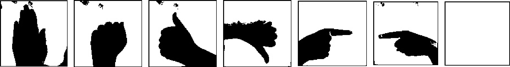
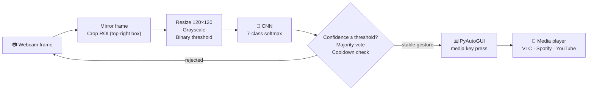
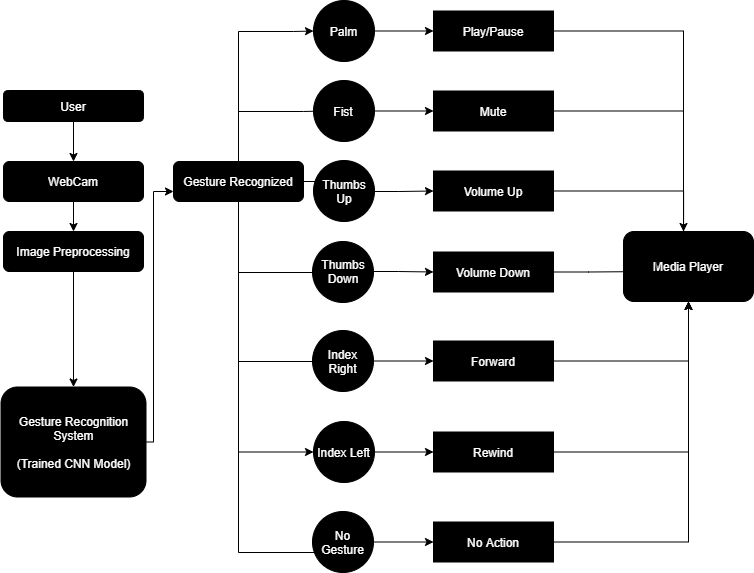
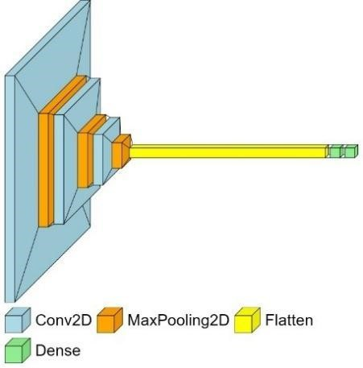

<div align="center">

# ✋ Gesture-Based Media Player (CNN)

### Touchless media control with real-time hand gesture recognition

Show a hand gesture to your webcam. A Convolutional Neural Network recognises it and your media player plays, pauses, mutes, changes volume or skips tracks. No keyboard, mouse or remote needed.




</div>

---

## 📑 Table of Contents

- [Overview](#-overview)
- [Features](#-features)
- [Gesture → Action Map](#-gesture--action-map)
- [How It Works](#-how-it-works)
- [Model Architecture](#-model-architecture)
- [Dataset](#-dataset)
- [Results](#-results)
- [Project Structure](#-project-structure)
- [Getting Started](#-getting-started)
- [Usage](#-usage)
- [Configuration](#-configuration)
- [Retraining the Model](#-retraining-the-model)
- [Troubleshooting](#-troubleshooting)
- [Known Limitations](#-known-limitations)
- [Future Scope](#-future-scope)
- [Team](#-team)

---

## 🔍 Overview

Keyboards, mice and remotes are hard to use when your hands are busy, when you are away from the device, or when you have limited motor ability. This project is a **vision-based, contactless media controller**. It needs only a standard webcam.

A region of interest (ROI) is taken from each webcam frame, preprocessed into a binary hand silhouette, and classified into one of **seven gesture classes** by a CNN built with TensorFlow/Keras. The predicted gesture is sent to the operating system as a **media key** through PyAutoGUI. That means it works with any player that responds to system media controls, such as VLC, Spotify, YouTube in the browser or Windows Media Player.

The project has two front-ends:

| Front-end | File | Best for |
|---|---|---|
| **Streamlit web app** (recommended) | [`localapp.py`](localapp.py) | Day-to-day use and demos: live dashboard, adjustable settings, debouncing, video recording |
| **OpenCV desktop script** | [`predict.py`](predict.py) | Minimal, dependency-light prediction loop |

---

## ✨ Features

- 🎥 **Real-time recognition** from any webcam, or from an uploaded video file
- 🧠 **Custom CNN**: 3 convolutional blocks, about 5.6M parameters, 120×120 grayscale input
- 🎛️ **Six media actions**: play/pause, mute, volume up/down, next/previous track
- 🛡️ **Protection against false triggers**:
  - confidence threshold that rejects uncertain predictions
  - majority-vote buffer that smooths predictions over recent frames
  - cooldown timer so toggle actions (play/pause, mute, skip) don't fire repeatedly
  - predictions only every *N* frames, which also lowers CPU load
- 📊 **Live dashboard**: detected gesture, last action, confidence bar, cooldown status and a preview of the processed ROI
- ⏺️ **Demo recording**: saves the annotated feed to `outputs/demo_output.mp4`
- 🎨 **Modern UI**: dark glassmorphism theme and an animated GSAP header
- 🗂️ **End-to-end pipeline included**: data collection, training, evaluation and deployment

---

## 🖐 Gesture → Action Map

| Gesture | Class label | Action | Media key sent |
|:---:|---|---|---|
| ✋ | `palm` | Play / Pause | `playpause` |
| ✊ | `fist` | Mute / Unmute | `volumemute` |
| 👍 | `thumbs-up` | Volume Up | `volumeup` |
| 👎 | `thumbs-down` | Volume Down | `volumedown` |
| 👉 | `index-right` | Forward (next track) | `nexttrack` |
| 👈 | `index-left` | Rewind (previous track) | `prevtrack` |
| ⬜ | `no-gesture` | No action | — |

> Volume gestures fire on every prediction, so holding 👍 keeps raising the volume. All other gestures are subject to the cooldown.

---

## ⚙ How It Works



<div align="center">

</div>

**Step by step**

1. **Capture.** Frames are read with OpenCV and mirrored so movements feel natural.
2. **Region of interest.** A fixed square in the top-right of the frame (drawn as a blue rectangle) is cropped. Only this area is analysed, so the user's face and body are ignored.
3. **Preprocessing.** The ROI is resized to **120 × 120**, converted to **grayscale** and **binary-thresholded**, leaving a black hand silhouette on a white background.
4. **Classification.** The CNN outputs a probability for each of the 7 classes, and the class with the highest probability is taken as the prediction.
5. **Post-processing** (web app only). Predictions below the confidence threshold become `no-gesture`. A short majority-vote buffer stabilises the output, and a cooldown blocks repeated toggles.
6. **Actuation.** PyAutoGUI presses the matching OS media key, and the active media player responds.

---

## 🧠 Model Architecture

The deployed model ([`gesture-model.json`](gesture-model.json) + [`gesture-model.h5`](gesture-model.h5)) is a sequential CNN:

| # | Layer | Configuration | Output shape | Parameters |
|---|---|---|---|---:|
| 0 | Input | grayscale image | 120 × 120 × 1 | 0 |
| 1 | Conv2D | 32 filters, 3×3, ReLU | 118 × 118 × 32 | 320 |
| 2 | MaxPooling2D | 2×2 | 59 × 59 × 32 | 0 |
| 3 | Conv2D | 64 filters, 3×3, ReLU | 57 × 57 × 64 | 18,496 |
| 4 | MaxPooling2D | 2×2 | 28 × 28 × 64 | 0 |
| 5 | Conv2D | 128 filters, 3×3, ReLU | 26 × 26 × 128 | 73,856 |
| 6 | MaxPooling2D | 2×2 | 13 × 13 × 128 | 0 |
| 7 | Flatten | — | 21,632 | 0 |
| 8 | Dense | 256 units, ReLU | 256 | 5,538,048 |
| 9 | Dense | 7 units, Softmax | 7 | 1,799 |
| | | | **Total** | **5,632,519** |

<div align="center">

</div>

**Training configuration** ([`train.py`](train.py))

| Setting | Value |
|---|---|
| Optimiser | Adam |
| Loss | Categorical cross-entropy |
| Epochs | 7 |
| Batch size | 7 (125 steps per epoch) |
| Augmentation | rescale 1/255, shear 0.2, zoom 0.2 |
| Horizontal flip | **Disabled**: flipping would turn `index-right` into `index-left` |

---

## 🗃 Dataset

The dataset is **custom-built** with the capture tool in [`Hand Gesture Recognition.ipynb`](Hand%20Gesture%20Recognition.ipynb). The tool shows the live ROI, and pressing keys **0–6** saves the current thresholded frame to the matching class folder.

| Property | Value |
|---|---|
| Classes | 7 (`01_palm` … `07_no-gesture`) |
| Image format | 120 × 120, single-channel (binary) JPEG |
| Included in repo | **560 images**, 80 per class, in `dataset/data/train/data/` |
| Original training run | 875 train + 350 test images (125 + 50 per class) |

---

## 📈 Results

### Deployed model (3-block CNN, `train.py`)

Trained on 875 images and validated on 350 held-out images captured with the same tool:

| Epoch | 1 | 2 | 3 | 4 | 5 | 6 | 7 |
|---|---|---|---|---|---|---|---|
| Train accuracy | 82.0% | 99.4% | 99.98% | 99.2% | 99.4% | 100% | 100% |
| Validation accuracy | 96.6% | 99.4% | 99.7% | 99.7% | 100% | 100% | **100%** |

### Evaluation study (`Result Analysis.ipynb`)

A deeper variant with 2 + 1 convolutional layers, Dropout 0.3 and RMSprop was trained on the **bundled 560-image dataset** with a 70 / 30 split and evaluated in detail.

**Test accuracy: 98.81%** on 168 images · **macro F1: 0.99**

| Class | Precision | Recall | F1-score | Support |
|---|:---:|:---:|:---:|:---:|
| palm | 0.96 | 1.00 | 0.98 | 22 |
| fist | 1.00 | 0.91 | 0.95 | 23 |
| thumbs-up | 0.96 | 1.00 | 0.98 | 23 |
| thumbs-down | 1.00 | 1.00 | 1.00 | 24 |
| index-right | 1.00 | 1.00 | 1.00 | 26 |
| index-left | 1.00 | 1.00 | 1.00 | 18 |
| no-gesture | 1.00 | 1.00 | 1.00 | 32 |

Only 2 of the 168 test images were misclassified, both `fist` (one predicted as `palm`, one as `thumbs-up`). A closed fist is the silhouette most easily confused with other hand shapes.

<div align="center">

<br><sub>Normalised confusion matrix from a separate evaluation run (97.78% overall accuracy).</sub>
</div>

> **Note:** the training and test images were captured by the same people under the same conditions. Accuracy in real use depends heavily on lighting and background (see [Known Limitations](#-known-limitations)).

---

## 📁 Project Structure

```
Gesture-Based-Media-Player-CNN/
├── dataset/
│   └── data/train/data/            # 560 preprocessed 120×120 images
│       ├── 01_palm/                #   80 images per class
│       ├── 02_fist/
│       ├── 03_thumbs-up/
│       ├── 04_thumbs-down/
│       ├── 05_index-right/
│       ├── 06_index-left/
│       └── 07_no-gesture/
├── images/                          # Figures used in this README / report
├── Hand Gesture Recognition.ipynb   # Data collection → training → live prediction
├── Result Analysis.ipynb            # Evaluation: confusion matrix, precision/recall, plots
├── train.py                         # Standalone training script
├── predict.py                       # Minimal OpenCV desktop controller
├── localapp.py                      # Streamlit web app (recommended)
├── gesture-model.json               # Model architecture (Keras JSON)
├── gesture-model.h5                 # Trained weights (loaded by both apps)
├── handrecognition_model.hdf5       # Full-model checkpoint of a lighter variant (32-64-64 conv, Dense 128)
└── requirements.txt                 # Python dependencies
```

---

## 🚀 Getting Started

### Prerequisites

| Requirement | Details |
|---|---|
| OS | Windows 10 / 11 (PyAutoGUI media keys are most reliable on Windows) |
| Python | 3.8 – 3.11 |
| Hardware | Webcam (720p or better), 4 GB+ RAM, any modern CPU (GPU optional) |

### Installation

```bash
# 1. Clone the repository
git clone https://github.com/mdfaiz04/Gesture-Based-Media-Player-CNN.git
cd Gesture-Based-Media-Player-CNN

# 2. Create and activate a virtual environment
python -m venv venv
venv\Scripts\activate            # Windows
# source venv/bin/activate       # macOS / Linux

# 3. Install dependencies
pip install -r requirements.txt
```

> **Why `tensorflow<2.16`?** The model files were saved with Keras 2.4, and `train.py` uses Keras 2 APIs such as `ImageDataGenerator`. TensorFlow 2.16+ ships Keras 3, where those APIs have been removed.

---

## 🎮 Usage

### Option 1: Streamlit web app (recommended)

```bash
streamlit run localapp.py
```

1. Open **http://localhost:8501** in your browser.
2. Start playing something in your media player (VLC, Spotify, YouTube…).
3. Click **Start Web Camera / Video**.
4. Hold your hand inside the **blue rectangle** at the top-right of the feed.
5. Watch the **Live Status** panel for the detected gesture, the action, the confidence and the cooldown.

To stop, refresh the page or press `Ctrl + C` in the terminal.

### Option 2: OpenCV desktop script

```bash
python predict.py
```

Two windows open: the camera feed with the gesture and action overlay, and the thresholded ROI. Press **`q`** to quit.

> `predict.py` sends a key press on **every frame** and has no smoothing or cooldown. Holding a palm will toggle play/pause over and over. Use it for quick testing, and use the web app for real control.

---

## 🔧 Configuration

The web app's sidebar exposes all runtime settings:

| Setting | Default | Range | What it does |
|---|:---:|:---:|---|
| Camera index | `0` | 0 – 10 | Chooses the webcam (`0` is the default device) |
| Prediction interval | `8` frames | 1 – 20 | Runs the CNN once every *N* frames; higher values use less CPU but react more slowly |
| Confidence threshold | `0.75` | 0.1 – 1.0 | Predictions below this value become `no-gesture` |
| Gesture buffer size | `2` | 1 – 6 | Number of recent predictions used in the majority vote |
| Cooldown | `4.0` s | 0 – 5 s | Minimum time between two toggle actions (play/pause, mute, skip) |
| Use sample video | off | — | Use an uploaded `.mp4/.avi/.mov` file, or `sample_video.mp4`, instead of the webcam |
| Record demo | off | — | Saves the annotated output to `outputs/demo_output.mp4` |

The **binary threshold** is set in code and should be tuned to your lighting:

| File | Threshold |
|---|:---:|
| Data collection (notebook) | 130 |
| `localapp.py` | 150 |
| `predict.py` | 180 |

If the ROI preview looks mostly black, raise the value. If the hand fades away, lower it.

---

## 🔁 Retraining the Model

1. **Collect data.** Run the *Data Collection* cells in `Hand Gesture Recognition.ipynb`:
   - enter `train` or `test` as the mode
   - hold a gesture in the blue box and press its key (`0` palm, `1` fist, `2` thumbs-up, `3` thumbs-down, `4` index-right, `5` index-left, `6` no-gesture)
   - press `Esc` to finish

   Images are saved to `data/train/<class>/` and `data/test/<class>/`.
2. **Train.**
   ```bash
   python train.py
   ```
   This **overwrites** `gesture-model.json`, `gesture-model.h5` and `handrecognition_model.hdf5`.
3. **Evaluate.** Open `Result Analysis.ipynb`, set `data_path` to your dataset folder (it is hard-coded to a local Windows path), and run all cells to get the confusion matrix and classification report.

> 💡 Capture images under the lighting and background you will actually use. Collecting from several people and angles improves robustness a lot.

---

## 🧯 Troubleshooting

| Problem | Fix |
|---|---|
| `ModuleNotFoundError: keras.layers.convolutional` | Your Keras is newer than the script. Change the import to `from tensorflow.keras.layers import Conv2D, MaxPooling2D`, or install an older TensorFlow 2.x. |
| Webcam doesn't open | Change the **Camera index** in the sidebar, and close other apps that are using the camera. |
| Wrong or unstable gestures | Use even, front-facing light and a plain background. Tune the binary threshold. Raise the confidence threshold or the buffer size. |
| Actions fire too often | Increase the **Cooldown** or the **Prediction interval**. |
| Media player doesn't respond | The player must handle **system media keys**. Test your keyboard's media keys first. Some players only respond while focused. |
| Forward/Rewind changes the track instead of seeking | Expected. These gestures send `nexttrack` / `prevtrack` media keys. |

---

## ⚠ Known Limitations

- **Fixed ROI.** The hand must be inside the box. There is no hand detection or tracking.
- **Sensitive to lighting and background.** A single global binary threshold separates hand from background, so shadows or cluttered backgrounds reduce accuracy.
- **Static gestures only.** Motion gestures such as swipes are not recognised.
- **Small, single-environment dataset.** 560–1,225 images from a small group of users.
- **Input scaling mismatch.** Training rescales pixels to `[0, 1]`, but both apps feed raw `0/255` values at inference. Dividing the ROI by `255.0` before `predict()` would match training and make the confidence scores more meaningful.
- **Stopping the web app loop** requires a page refresh, because the Stop button only shows a hint.
- **OS dependence.** PyAutoGUI media keys work best on Windows.

---

## 🔭 Future Scope

- 🖐️ **Hand landmark detection** (for example MediaPipe) to remove the fixed ROI and background dependence
- 🎞️ **Dynamic gestures** such as swipes and circles with CNN-LSTM or 3D-CNN models
- 🌗 **Adaptive thresholding** (Otsu or adaptive Gaussian) or skin-colour segmentation
- ⏩ **True seek** (±10 s) and app-specific shortcuts in addition to track skipping
- 📦 **Edge deployment** with TensorFlow Lite or ONNX for Raspberry Pi and low-power devices
- 🌍 **Larger, more diverse dataset** with transfer learning (MobileNetV2 / EfficientNet)

---

## 👥 Team

| Name |
|---|
| Rishi Raj Sharma |
| S Madan |
| MD Faiz |
| Tejaswini |

---

<div align="center">

**Built with** TensorFlow · Keras · OpenCV · PyAutoGUI · Streamlit

⭐ If you found this project useful, consider giving it a star!

</div>
